# PlayTogether — Architecture & Design Documentation

## Table of Contents

1. [Introduction](#introduction)
2. [High-Level Architecture](#high-level-architecture)
3. [System Design](#system-design)
4. [Features](#features)
5. [Database Design](#database-design)
6. [Low-Level Architecture](#low-level-architecture)
7. [API Reference](#api-reference)
8. [Role & Permission System](#role--permission-system)

---

## Introduction

PlayTogether is a full-stack sports event management platform. It allows organisations and groups to:

- Create and manage sports events end-to-end
- Organise games within events (individual or team-based)
- Track results and compute leaderboards with customisable point systems
- Manage participants, teams, and membership with role-based access
- Share events publicly via token-based links
- Collaborate in real time via WebSockets
- Audit all changes with full attribution

**Tech Stack**

| Layer | Technology |
|---|---|
| Frontend | React 18, Vite, React Router v6, Tailwind CSS, Axios |
| Backend | Go 1.21, Gin, Gorilla WebSocket, JWT (HS256) |
| Database | PostgreSQL 16 (pgcrypto extension) |
| Infrastructure | Docker, Docker Compose |

---

## High-Level Architecture

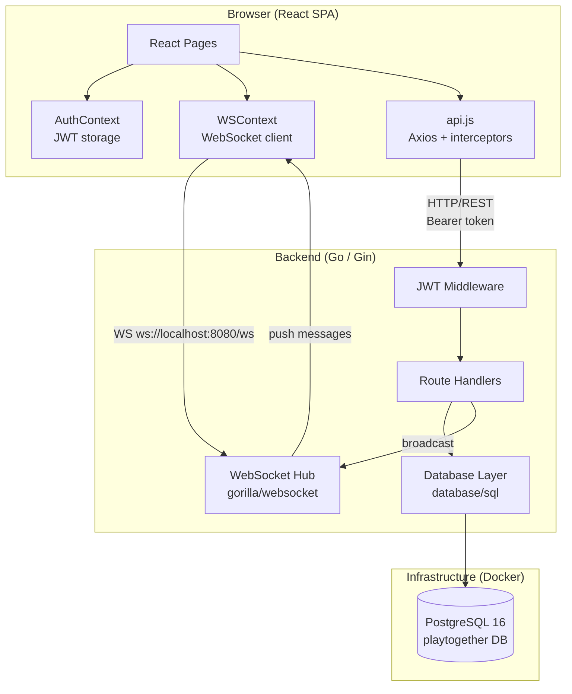

**Request flow:**
1. React SPA authenticates → receives JWT
2. Axios attaches `Authorization: Bearer <token>` to every request
3. Gin JWT middleware validates token, injects `user_id` into context
4. Handler executes business logic, writes to PostgreSQL
5. Handler broadcasts WebSocket message for real-time clients
6. WSContext in browser receives message → React state updates UI

---

## System Design

### Component Diagram

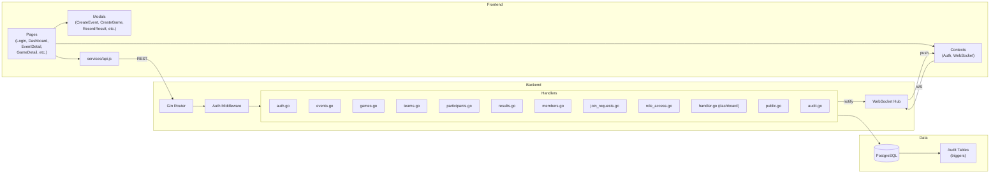

### Authentication Flow

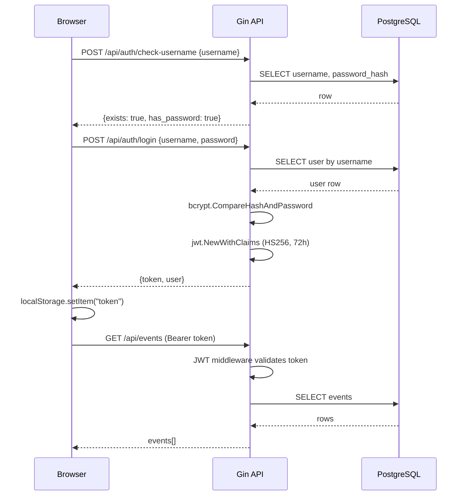

### Real-Time WebSocket Flow

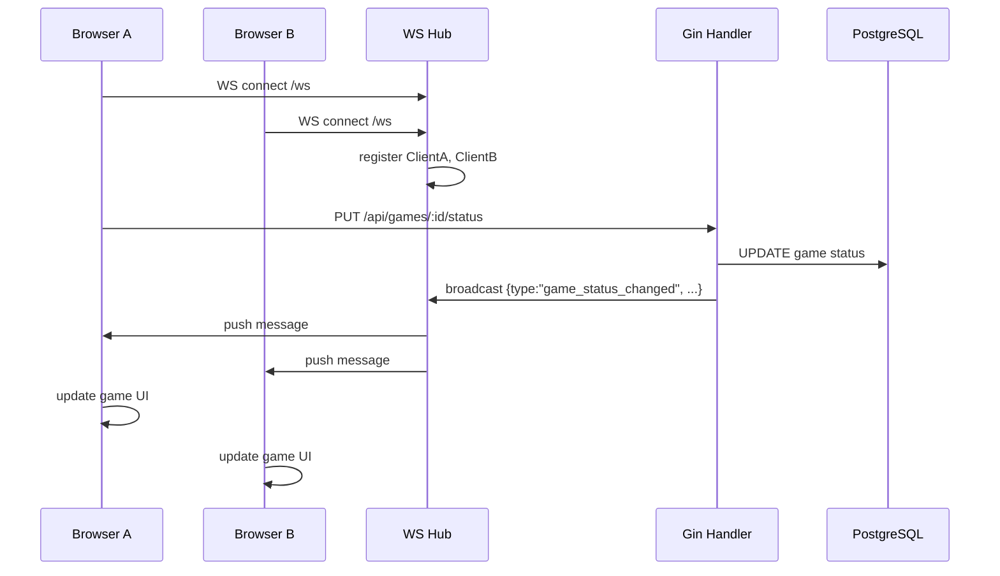

---

## Features

### Event Lifecycle
- Full status progression: `upcoming → active → completed`
- Configurable join questions (dynamic form stored as JSONB)
- Customisable point systems per rank position
- Public share links (token-based, revocable)
- Event logo support (Base64 or URL)

### Game Management
- Two modes: **individual** (single competitors) or **team**
- Optional age restrictions (`age_start`, `age_end`)
- Game-level venue and scheduling
- Status: `scheduled → active → completed / cancelled`
- Participants or teams attached directly to game via JSONB arrays

### Team Management
- Teams scoped to event; unique per event
- Optional logo, colour, description
- Members assigned to teams via `pt_event_members.team_id`

### Result Tracking
- JSONB `result_data` supports flexible ranking schema
- Point system aggregated to compute leaderboards
- Supports partial and complete result status
- Edit and delete with full audit trail

### Join Request Workflow
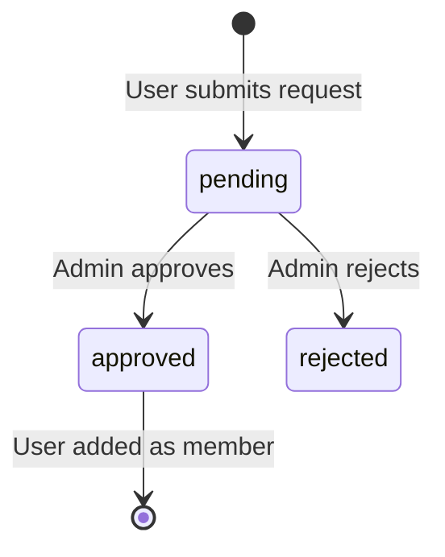

### Role Access Control
- Two layers: **global defaults** (NULL event_id) and **per-event overrides**
- 20+ configurable actions (add_game, modify_result, change_role, etc.)
- Granular: admin / coordinator / viewer flags per action

### Audit Trail
- PostgreSQL triggers on all core tables
- Records INSERT / UPDATE / DELETE with `row_data`, `old_data` (JSONB), `aud_changed_by` (user UUID), `aud_changed_at`
- Queryable via `/api/audit` (global) and `/api/events/:id/audit`

---

## Database Design

### Entity-Relationship Diagram

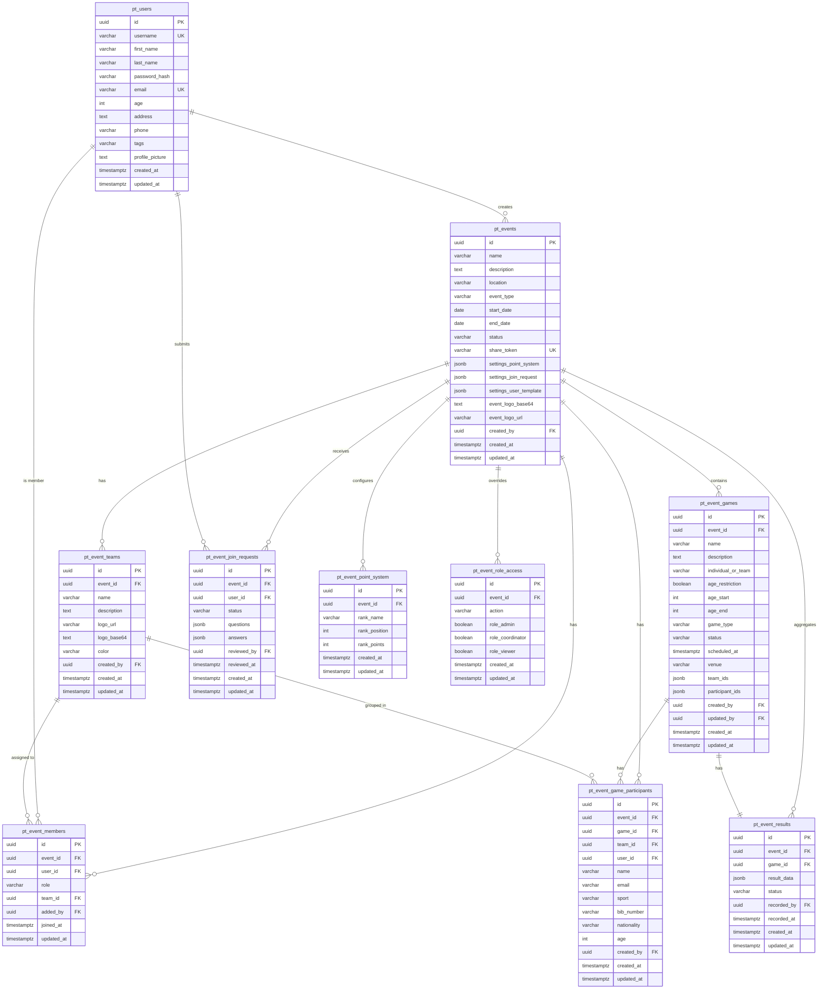

### Schema Notes

| Table | Key Constraint |
|---|---|
| `pt_event_members` | UNIQUE(event_id, user_id) |
| `pt_event_games` | UNIQUE(event_id, name, COALESCE(age_start,-1), COALESCE(age_end,-1)) |
| `pt_event_teams` | UNIQUE(event_id, name) |
| `pt_event_results` | UNIQUE(event_id, game_id) — one result per game |
| `pt_event_join_requests` | UNIQUE(event_id, user_id) |
| `pt_event_role_access` | UNIQUE(event_id, action) — NULL event_id = global defaults |

### Audit Tables

Every core table has a mirrored `*_aud` table populated by PostgreSQL triggers:

```
pt_events_aud
pt_event_members_aud
pt_event_games_aud
pt_event_teams_aud
pt_event_game_participants_aud
pt_event_join_requests_aud
pt_event_results_aud
```

Each audit row contains:

| Column | Type | Description |
|---|---|---|
| `aud_id` | UUID | Audit record PK |
| `aud_operation` | VARCHAR | INSERT / UPDATE / DELETE |
| `aud_changed_at` | TIMESTAMPTZ | When change occurred |
| `aud_changed_by` | UUID | User who made the change (set via `SET LOCAL app.current_user_id`) |
| `row_data` | JSONB | Full new row |
| `old_data` | JSONB | Previous row (NULL for INSERT) |

---

## Low-Level Architecture

### Backend Package Structure

```
backend/
├── main.go                  # Router setup, middleware wiring, server start
├── config/
│   └── config.go            # Env-based config (DB, JWT secret, port)
├── middleware/
│   └── auth.go              # JWT validation middleware; injects user_id to Gin context
├── models/
│   └── models.go            # All domain structs + JSON tags + ToResponse() helpers
├── handlers/
│   ├── handler.go           # Handler struct (db, jwtSecret, hub); dashboard endpoint
│   ├── auth.go              # Registration, login, password management, profile pictures
│   ├── events.go            # Event CRUD, status, settings, share links
│   ├── members.go           # Membership management, bulk add
│   ├── games.go             # Game CRUD, status transitions
│   ├── teams.go             # Team CRUD
│   ├── participants.go      # Participant CRUD
│   ├── game_participants.go # Game-level participant assignment
│   ├── results.go           # Result recording and editing
│   ├── join_requests.go     # Join request workflow
│   ├── role_access.go       # Role-action matrix management
│   ├── public.go            # Share-token public endpoint + leaderboard
│   └── audit.go             # Audit log query endpoint
└── websocket/
    └── hub.go               # Gorilla WS hub: client registry, broadcast, pumps
```

### Handler Dependency Graph

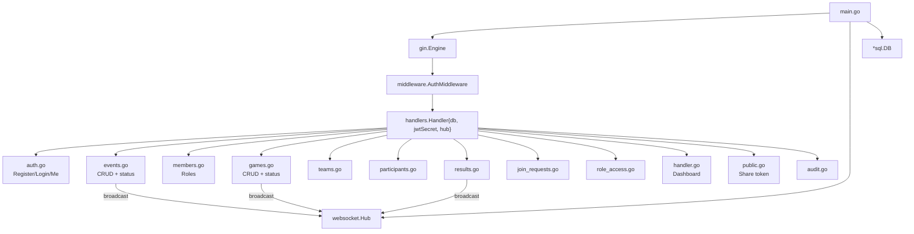

### WebSocket Hub

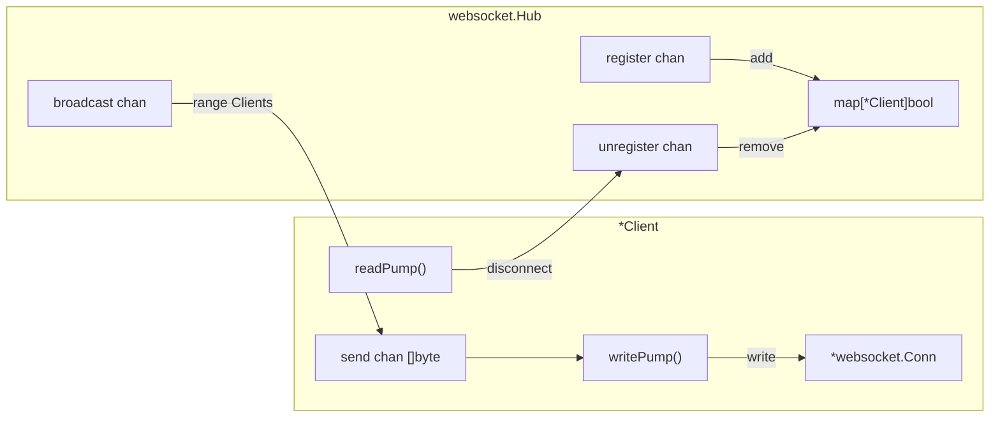

### Role Resolution Logic

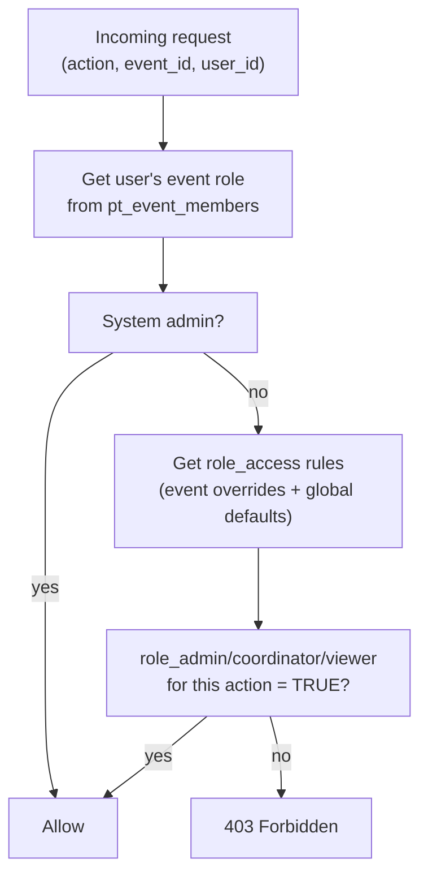

### Data Flow: Record Result

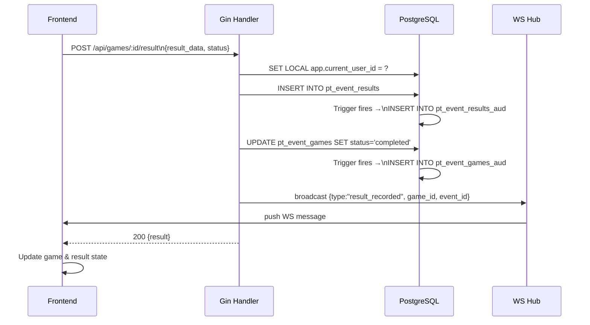

### Frontend State Architecture

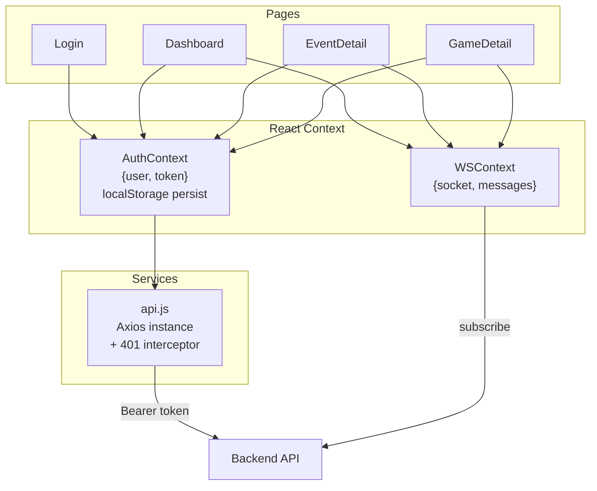

---

## API Reference

### Auth

| Method | Path | Auth | Description |
|---|---|---|---|
| POST | `/api/auth/register` | — | Register user |
| POST | `/api/auth/login` | — | Login → JWT |
| POST | `/api/auth/check-username` | — | Check username + has_password |
| POST | `/api/auth/preview-username` | — | Generate username from name |
| POST | `/api/auth/set-password` | — | Set password for admin-created user |
| GET | `/api/auth/me` | JWT | Current user profile |
| DELETE | `/api/auth/me` | JWT | Delete own account |
| PUT | `/api/auth/me/password` | JWT | Change password |
| PUT | `/api/auth/me/profile-picture` | JWT | Upload profile picture |
| DELETE | `/api/auth/me/profile-picture` | JWT | Remove profile picture |
| GET | `/api/auth/users` | JWT+Admin | List all users |
| POST | `/api/auth/users` | JWT+Admin | Create user |
| PUT | `/api/auth/users/:id` | JWT+Admin | Update user |
| DELETE | `/api/auth/users/:id` | JWT+Admin | Delete user |
| PUT | `/api/auth/users/:id/password` | JWT+Admin | Admin reset password |

### Events

| Method | Path | Auth | Description |
|---|---|---|---|
| GET | `/api/events` | JWT | List events |
| POST | `/api/events` | JWT | Create event |
| GET | `/api/events/:id` | JWT | Get event |
| PUT | `/api/events/:id` | JWT+Admin | Update event |
| PATCH | `/api/events/:id/status` | JWT+Admin | Update status |
| PATCH | `/api/events/:id/settings` | JWT+Admin | Update settings |
| DELETE | `/api/events/:id` | JWT+Admin | Delete event |
| POST | `/api/events/:id/share` | JWT+Admin | Generate share link |
| DELETE | `/api/events/:id/share` | JWT+Admin | Revoke share link |

### Games, Teams, Participants, Results

| Method | Path | Description |
|---|---|---|
| GET/POST | `/api/events/:id/games` | List / create games |
| GET/PUT/PATCH/DELETE | `/api/games/:id` | Get / update / status / delete game |
| GET/POST | `/api/events/:id/teams` | List / create teams |
| GET/PUT/DELETE | `/api/teams/:id` | Get / update / delete team |
| GET/POST | `/api/events/:id/participants` | List / create participants |
| GET/PUT/DELETE | `/api/participants/:id` | Get / update / delete participant |
| GET/POST | `/api/games/:id/participants` | List / add game participants |
| GET/POST/PUT | `/api/games/:id/result` | Get / record / update result |
| DELETE | `/api/results/:id` | Delete result |
| GET | `/api/events/:id/results` | All results in event |

### Members, Join Requests, Roles, Audit

| Method | Path | Description |
|---|---|---|
| GET/POST | `/api/events/:id/members` | List / add members |
| POST | `/api/events/:id/members/bulk` | Bulk add members |
| PUT/DELETE | `/api/events/:id/members/:userId` | Update / remove member |
| GET | `/api/events/:id/my-role` | Current user's role |
| POST/GET | `/api/events/:id/join-requests` | Submit / list join requests |
| GET | `/api/events/:id/my-join-request` | Own join request |
| PATCH | `/api/events/:id/join-requests/:userId` | Approve / reject |
| GET/PUT/DELETE | `/api/events/:id/role-access` | Get / set / reset role access |
| GET | `/api/audit` | System audit log |
| GET | `/api/events/:id/audit` | Event audit log |
| GET | `/api/public/events/:token` | Public share view (no auth) |
| GET | `/ws` | WebSocket endpoint |
| GET | `/health` | Health check |

---

## Role & Permission System

### Event Roles

| Role | Description |
|---|---|
| `admin` | Full event control — edit, delete, manage members, games, results |
| `coordinator` | Create/manage games, participants, record results |
| `viewer` | Read-only |

### Default Action Matrix

| Action | admin | coordinator | viewer |
|---|---|---|---|
| add_result | ✓ | ✓ | — |
| modify_result | ✓ | ✓ | — |
| add_game | ✓ | ✓ | — |
| modify_game | ✓ | ✓ | — |
| start_game | ✓ | ✓ | — |
| cancel_game | ✓ | ✓ | — |
| delete_game | ✓ | — | — |
| add_participant | ✓ | ✓ | — |
| remove_participant | ✓ | ✓ | — |
| modify_participant | ✓ | ✓ | — |
| add_team | ✓ | — | — |
| modify_team | ✓ | — | — |
| add_member | ✓ | — | — |
| remove_member | ✓ | — | — |
| modify_member | ✓ | — | — |
| add_coordinator | ✓ | — | — |
| add_admin | ✓ | — | — |
| change_role | ✓ | — | — |
| member_join_request_approval | ✓ | — | — |
| settings_visibility | ✓ | — | — |

Per-event overrides stored in `pt_event_role_access`. NULL `event_id` = global defaults applied to all events.
